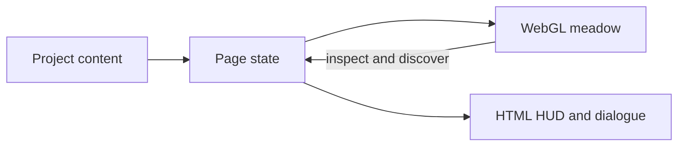

# Aiden Guan — The Meadow

An interactive portfolio where visitors part a pixelated 3D meadow to discover projects, inspect objects, and find contact details.

## Explore the work

- Discover four project relics: SideSpace, Million Dollar Leaderboard, Corgi, and RideRelay.
- Open project descriptions and links through the dialogue interface.
- Use the project list in the HUD to inspect work directly.
- Press Escape to close the current dialogue or project list.

## Quick start

Use Node.js 22.12+ and npm, with a browser that supports WebGL.

```bash
git clone https://github.com/aiden-guan/aiden-portfolio.git
cd aiden-portfolio
npm ci
npm run dev
```

Open [localhost:3000](http://localhost:3000). The application does not require API credentials or a database. Google fonts are loaded through `next/font`, so font retrieval requires network access during a production build.

```bash
npm run lint
npm run build
npm start
```

`npm start` serves the production build after `npm run build` succeeds. There is no automated test script in the current package manifest.

## Engineering notes

Next.js 16 and React 19 provide the page and HTML interface. Three.js, React Three Fiber, and Drei render the meadow; Tailwind CSS 4 and custom CSS style the HUD.

The canvas loads only in the browser through a dynamic import. React state connects scene inspection to the HTML dialogue and tracks discoveries for the current session. A reduced-motion preference is passed into the scene; this is not a claim of complete accessibility or device compatibility.



## Source guide

| Location | Purpose |
| --- | --- |
| [lib/content.ts](lib/content.ts) | Project descriptions, destinations, and contact information |
| [app/page.tsx](app/page.tsx) | Inspection, discovery, and overlay state |
| [components/scene](components/scene) | Meadow, grass, weather, relics, and rendering |
| [components/hud](components/hud) | Project list, dialogue, and cursor |
| [app/globals.css](app/globals.css) | Interface styling |

## Status and limits

This repository contains an interactive portfolio implementation. No verified hosted demo or product screenshot is included here yet. Rendering performance, touch behavior, and keyboard coverage need browser and device testing; the source alone does not establish them. Discovery state is held in memory and resets when the page reloads.

The production build passed during this documentation pass. Lint currently reports seven errors in scene code (hook immutability and render purity) plus one dependency warning; it is not a passing check yet.

No license file is currently included.
